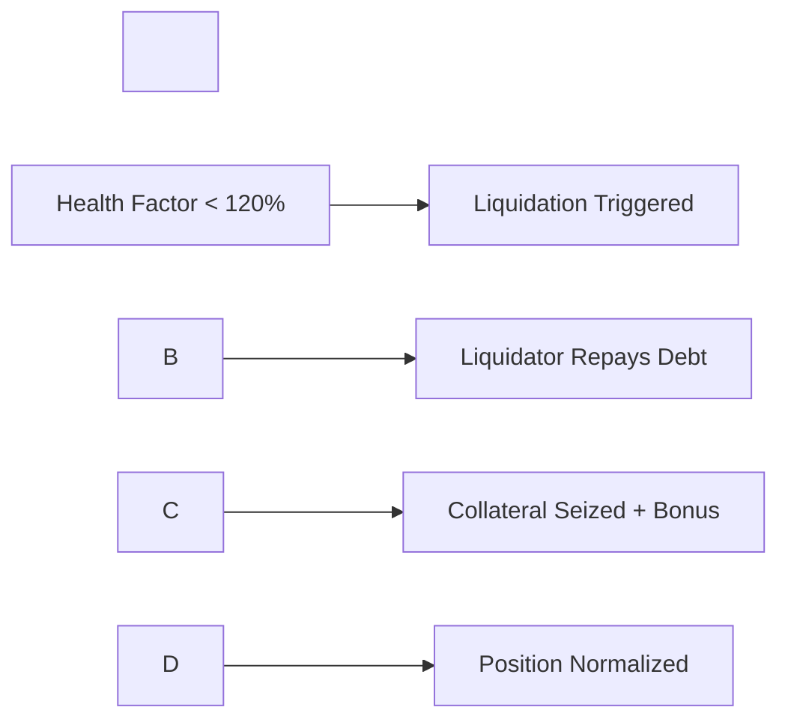

\# 🏢 Morpho RWA Liquidity Hub


\*\*Instant liquidity for Real World Assets through the Morpho protocol\*\*


!\[License](https://img.shields.io/badge/license-MIT-blue.svg)

!\[Solidity](https://img.shields.io/badge/solidity-^0.8.19-green.svg)

!\[Network](https://img.shields.io/badge/network-Ethereum%20%7C%20Base%20%7C%20Sepolia-orange.svg)


---


\## 🎯 \*\*Overview\*\*


The Morpho RWA Liquidity Hub enables private clients to unlock instant liquidity from their Real World Assets (RWAs) by using them as collateral to borrow stablecoins through the battle-tested Morpho protocol.


\### \*\*🚀 Key Features\*\*


\- \*\*🏠 RWA Collateral\*\* - Support for tokenized real estate, commodities, treasuries, and more

\- \*\*⚡ Instant Liquidity\*\* - Borrow USDC immediately against RWA collateral

\- \*\*🔒 Morpho Integration\*\* - Built on Morpho Blue's proven lending infrastructure

\- \*\*🛡️ Risk Management\*\* - Comprehensive health factor monitoring and liquidation protection

\- \*\*👥 KYC Compliance\*\* - Integrated Coinbase Verifications for regulatory compliance

\- \*\*📊 Advanced Analytics\*\* - Real-time position tracking and risk assessment


---


\## 🏗️ \*\*Architecture\*\*


```

┌─────────────────┐    ┌──────────────────┐    ┌─────────────────┐

│   RWA Client    │───▶│  Liquidity Hub   │───▶│  Morpho Blue    │

│                 │    │                  │    │                 │

│ • Real Estate   │    │ • Position Mgmt  │    │ • Lending Pool  │

│ • Commodities   │    │ • Risk Analysis  │    │ • Liquidations  │

│ • Treasuries    │    │ • Oracle Integration │ │ • Interest Rates │

└─────────────────┘    └──────────────────┘    └─────────────────┘

```


\### \*\*Core Components\*\*


| Component | Description | Status |

|-----------|-------------|---------|

| \*\*MorphoRWALiquidityHub\*\* | Main lending contract | ✅ Deployed |

| \*\*RWAOracle\*\* | Price feed system | ✅ Deployed |

| \*\*MockRWATokens\*\* | Test RWA tokens | ✅ Deployed |

| \*\*Frontend Dashboard\*\* | Web3 user interface | ✅ Live |


---


\## 🚀 \*\*Quick Start\*\*


\### \*\*Prerequisites\*\*


\- Node.js v18+ 

\- npm or yarn

\- MetaMask or compatible Web3 wallet

\- Sepolia testnet ETH


\### \*\*Installation\*\*


```bash

\# Clone the repository

git clone https://github.com/your-username/morpho-rwa-liquidity-hub.git

cd morpho-rwa-liquidity-hub


\# Install dependencies

npm install


\# Set up environment variables

cp .env.example .env

\# Edit .env with your configuration


\# Compile contracts

npm run compile


\# Deploy to Sepolia testnet

npm run deploy:tokens

```


\### \*\*Frontend Setup\*\*


```bash

\# Navigate to frontend

cd morpho-rwa-frontend


\# Install dependencies

npm install


\# Start development server

npm run dev


\# Open http://localhost:3000

```


---


\## 📋 \*\*Contract Addresses\*\*


\### \*\*Sepolia Testnet\*\*


| Contract | Address | Description |

|----------|---------|-------------|

| \*\*RWA Liquidity Hub\*\* | `0xC085e5E50872D597DE3e3195C74ca953e4a3851A` | Main lending contract |

| \*\*RWA Oracle\*\* | `0x0403F1a45e538eebF887afD1f7318fA3255f1273` | Price oracle system |

| \*\*CFG-RE Token\*\* | `0x988EED42856A332211162DbF368CBE805d9C59B2` | Real Estate RWA Token |

| \*\*MPL-CC Token\*\* | `0x9dbAb878c774eb5506ad68aA9EA4b8362A5F744f` | Corporate Credit RWA Token |

| \*\*TRU-UL Token\*\* | `0xAb16820FFf7899e5ef605A1FD996B6C004796bb1` | Uncollateralized Loans RWA Token |


---


\## 💼 \*\*How It Works\*\*


\### \*\*For RWA Holders\*\*


1\. \*\*🔐 Connect Wallet\*\* - Connect your Web3 wallet to the platform

2\. \*\*🪙 Get Test Tokens\*\* - Mint test RWA tokens (Sepolia testnet only)

3\. \*\*📊 Select RWA Type\*\* - Choose from real estate, corporate credit, or loan tokens

4\. \*\*💰 Deposit Collateral\*\* - Deposit your RWA tokens as collateral

5\. \*\*💸 Borrow USDC\*\* - Instantly borrow against your collateral value

6\. \*\*📈 Monitor Position\*\* - Track health factor and manage risk


\### \*\*Example Transaction Flow\*\*


```solidity

// 1. Approve RWA token

IERC20(rwaToken).approve(liquidityHub, collateralAmount);


// 2. Supply collateral and borrow in one transaction

liquidityHub.supplyCollateralAndBorrow(

&nbsp;   rwaToken,        // RWA token address

&nbsp;   1000e18,         // 1000 RWA tokens as collateral

&nbsp;   25000e6          // Borrow 25,000 USDC

);


// 3. Repay and withdraw when ready

liquidityHub.repayAndWithdraw(

&nbsp;   rwaToken,

&nbsp;   25000e6,         // Repay amount

&nbsp;   500e18,          // Withdraw 500 RWA tokens

&nbsp;   false            // Partial repayment

);

```


---


\## 🛡️ \*\*Risk Management\*\*


\### \*\*Safety Parameters\*\*


| Parameter | Value | Description |

|-----------|-------|-------------|

| \*\*Minimum Collateral Ratio\*\* | 150% | Minimum health factor threshold |

| \*\*Liquidation Threshold\*\* | 120% | Point at which liquidation can occur |

| \*\*Maximum LTV\*\* | 80% | Maximum loan-to-value ratio |

| \*\*Platform Fee\*\* | 0.5% | Fee charged on borrowing |


\### \*\*Liquidation Process\*\*





---


\## 🎛️ \*\*Supported RWA Types\*\*


| Asset Type | Symbol | Description | Oracle |

|------------|--------|-------------|--------|

| \*\*Real Estate\*\* | CFG-RE | Tokenized real estate assets | Chainlink |

| \*\*Corporate Credit\*\* | MPL-CC | Institutional lending tokens | Chainlink |

| \*\*Uncollateralized Loans\*\* | TRU-UL | Unsecured lending protocols | Chainlink |


\### \*\*Adding New RWA Types\*\*


```solidity

// Admin function to add new RWA markets

function createRWAMarket(

&nbsp;   address rwaToken,

&nbsp;   RWAConfig calldata config

) external onlyOwner {

&nbsp;   // Creates isolated Morpho market for new RWA type

}

```


---


\## 📊 \*\*Dashboard Features\*\*


\### \*\*Demo Mode\*\*

\- 🔵 \*\*Safe Testing\*\* - Mock data for presentations and testing

\- 📊 \*\*Realistic Analytics\*\* - Full UI experience without blockchain calls

\- 🎭 \*\*Client Demonstrations\*\* - Perfect for showing potential clients


\### \*\*Live Mode\*\*

\- 🟢 \*\*Real Transactions\*\* - Actual blockchain interactions

\- ⛽ \*\*Gas Estimation\*\* - Smart gas optimization

\- 📈 \*\*Live Data\*\* - Real-time position and market data

\- 🔗 \*\*Etherscan Integration\*\* - Direct links to transaction details


---


\## 🔧 \*\*Development\*\*


\### \*\*Project Structure\*\*


```

morpho-rwa-liquidity-hub/

├── contracts/                 # Smart contracts

│   ├── MorphoRWALiquidityHub.sol

│   ├── RWAOracle.sol

│   └── MockRWAToken.sol

├── scripts/                   # Deployment scripts

│   ├── deploy.js

│   ├── deploy-mock-tokens.js

│   └── universal-updater.js

├── morpho-rwa-frontend/       # Next.js frontend

│   ├── pages/

│   ├── components/

│   ├── hooks/

│   └── utils/

└── test/                      # Test files

```


\### \*\*Available Scripts\*\*


```bash

\# Smart contracts

npm run compile              # Compile contracts

npm run test                # Run tests

npm run deploy              # Deploy to network

npm run verify              # Verify on Etherscan


\# Mock tokens

npm run deploy:tokens       # Deploy test RWA tokens

npm run deploy:tokens:local # Deploy to local network


\# Configuration

npm run config:update       # Universal config updater

npm run config:quick        # Quick configuration

```


\### \*\*Testing\*\*


```bash

\# Run contract tests

npm run test


\# Test frontend

cd morpho-rwa-frontend

npm run test


\# Test with forked mainnet

npx hardhat test --network mainnet-fork

```


---


\## 🌐 \*\*Deployments\*\*


\### \*\*Testnet (Sepolia)\*\*

\- ✅ \*\*Live and functional\*\*

\- 🪙 \*\*Test tokens available\*\*

\- 🔗 \*\*Frontend deployed\*\*


\### \*\*Mainnet (Coming Soon)\*\*

\- 📋 \*\*Audit in progress\*\*

\- 🏛️ \*\*Institutional partnerships\*\*

\- 📈 \*\*Production ready\*\*


---


\## 🤝 \*\*Contributing\*\*


We welcome contributions! Please see our \[Contributing Guidelines](CONTRIBUTING.md).


\### \*\*Development Workflow\*\*


1\. Fork the repository

2\. Create a feature branch (`git checkout -b feature/amazing-feature`)

3\. Commit your changes (`git commit -m 'Add amazing feature'`)

4\. Push to the branch (`git push origin feature/amazing-feature`)

5\. Open a Pull Request


\### \*\*Code Style\*\*


\- Follow \[Solidity Style Guide](https://docs.soliditylang.org/en/latest/style-guide.html)

\- Use Prettier for JavaScript/TypeScript formatting

\- Include comprehensive tests for new features


---


\## 📚 \*\*Documentation\*\*


\- 📖 \*\*\[Smart Contract Documentation](docs/contracts.md)\*\*

\- 🎛️ \*\*\[Frontend Integration Guide](docs/frontend.md)\*\*

\- 🔌 \*\*\[API Reference](docs/api.md)\*\*

\- 🛡️ \*\*\[Security Considerations](docs/security.md)\*\*


---


\## 🔐 \*\*Security\*\*


\### \*\*Audits\*\*

\- 🔍 \*\*Internal Review\*\* - ✅ Complete

\- 🏛️ \*\*External Audit\*\* - 📋 Planned

\- 🐛 \*\*Bug Bounty\*\* - 💰 Coming Soon


\### \*\*Security Features\*\*

\- ✅ ReentrancyGuard protection

\- ✅ Access control with OpenZeppelin

\- ✅ Emergency pause functionality

\- ✅ Comprehensive input validation

\- ✅ Oracle timeout protection


\### \*\*Reporting Issues\*\*


Found a security issue? Please email: security@morpho-rwa-hub.com


---


\## 📄 \*\*License\*\*


This project is licensed under the MIT License - see the \[LICENSE](LICENSE) file for details.


---


\## 🙏 \*\*Acknowledgments\*\*


\- \*\*\[Morpho Labs](https://morpho.org/)\*\* - For the incredible Morpho Blue protocol

\- \*\*\[OpenZeppelin](https://openzeppelin.com/)\*\* - For secure smart contract libraries  

\- \*\*\[Chainlink](https://chain.link/)\*\* - For reliable price oracle infrastructure

\- \*\*\[Coinbase](https://www.coinbase.com/)\*\* - For KYC/AML verification services


---


\## 📞 \*\*Contact\*\*


\- \*\*Website\*\*: \[morpho-rwa-hub.com](https://morpho-rwa-hub.com)

\- \*\*Email\*\*: contact@morpho-rwa-hub.com

\- \*\*Twitter\*\*: \[@MorphoRWAHub](https://twitter.com/MorphoRWAHub)

\- \*\*Discord\*\*: \[Join our community](https://discord.gg/morpho-rwa-hub)


---


\## 🚀 \*\*Get Started\*\*


Ready to unlock liquidity from your Real World Assets?


```bash

git clone https://github.com/your-username/morpho-rwa-liquidity-hub.git

cd morpho-rwa-liquidity-hub

npm install

npm run deploy:tokens

cd morpho-rwa-frontend

npm run dev

```


\*\*Visit \[http://localhost:3000](http://localhost:3000) and start borrowing against your RWAs!\*\*


---


\*Built with ❤️ for the future of decentralized finance\*

